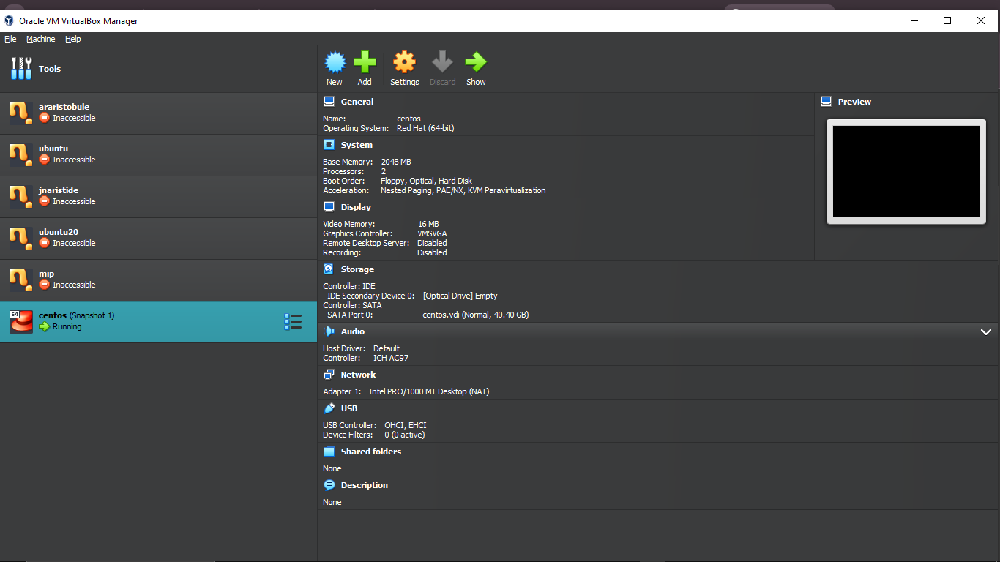
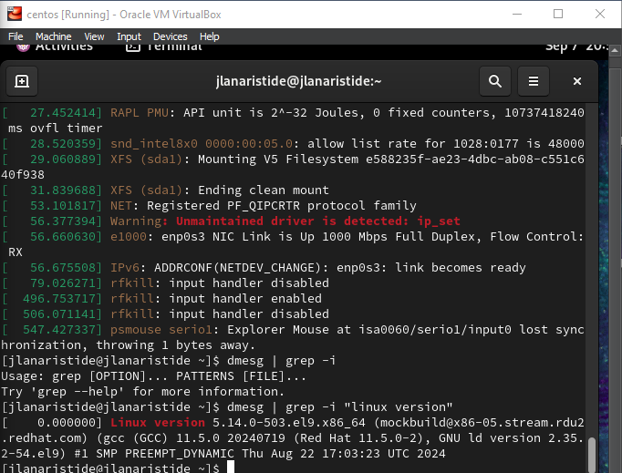
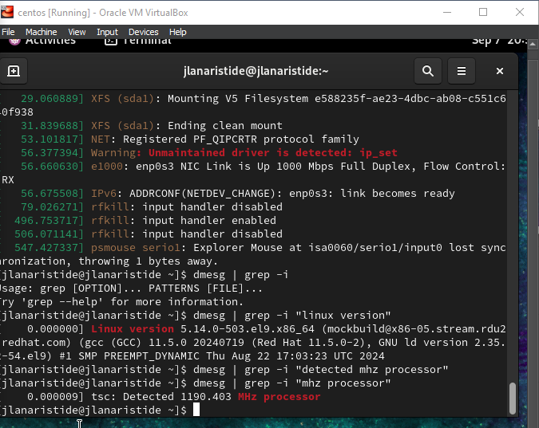
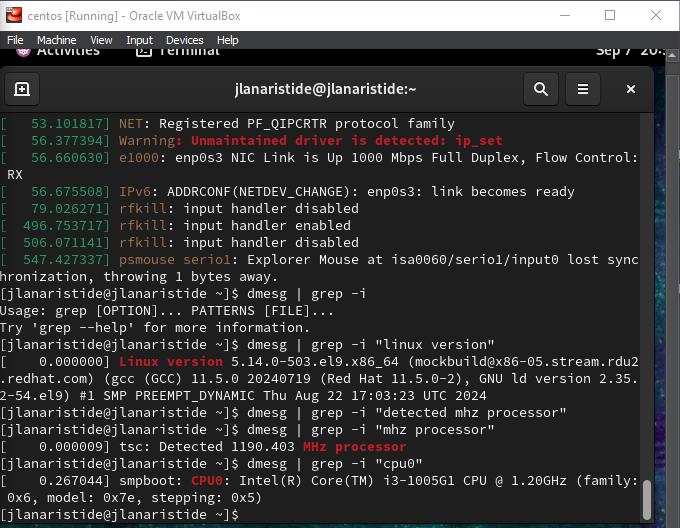

---
## Front matter
lang: ru-RU
title: Презентация Лаб
subtitle: Лаб 1
author:
  - Аристид Ж. Л.
institute:
  - Российский университет дружбы народов, Москва, Россия
date: 08 september 2024

## i18n babel
babel-lang: russian
babel-otherlangs: english

## Formatting pdf
toc: false
toc-title: Содержание
slide_level: 2
aspectratio: 169
section-titles: true
theme: metropolis
header-includes:
  - \metroset{progressbar=frametitle,sectionpage=progressbar,numbering=fraction}
---

# Информация

## Докладчик

:::::::::::::: {.columns align=center}
::: {.column width="70%"}

- Аристид Жан Лоэнс
- Студент
- Российский университет дружбы народов

:::
::::::::::::::

# Вводная часть

## Объект и предмет исследования

- Linux
- Virtual Machine
- Centos

## Цели и задачи

- Целью данной работы является приобретение практических навыков установки операционной системы на виртуальную машину, настройки минимально необходимых для дальнейшей работы сервисов

# Результаты

## Установка и конфигурация virtual machine

Установка и конфигурация virtual machine (рис. [-@fig:001]).

{#fig:001 width=70%}

## Команд dmesg

Версия ядра Linux (рис. [-@fig:003]).

{#fig:003 width=70%}

## Команд dmesg

Частота процессора (рис. [-@fig:004]).

{#fig:004 width=70%}

## Команд dmesg

Модель процессора (рис. [-@fig:005]).

{#fig:005 width=70%}

# Итоговый слайд

Благодаря виртуальной машине мы можем использовать параллельно с операционной системой нашего компьютера другую операционную систему, в данном случае Linux.
