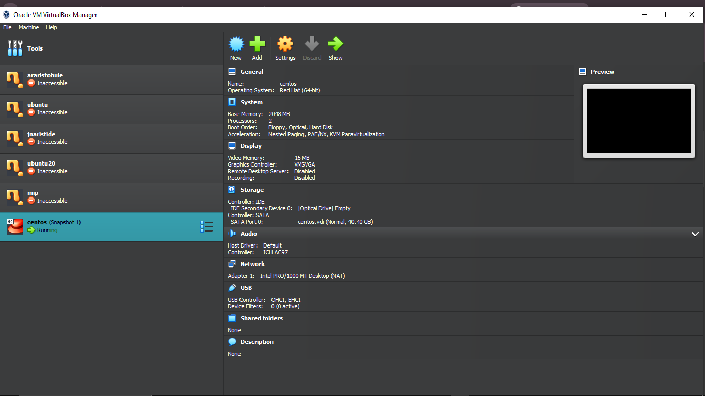
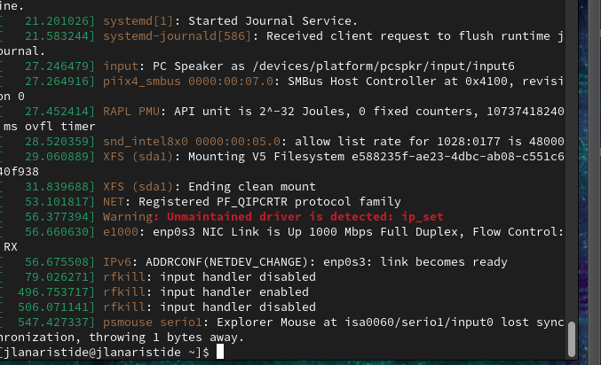
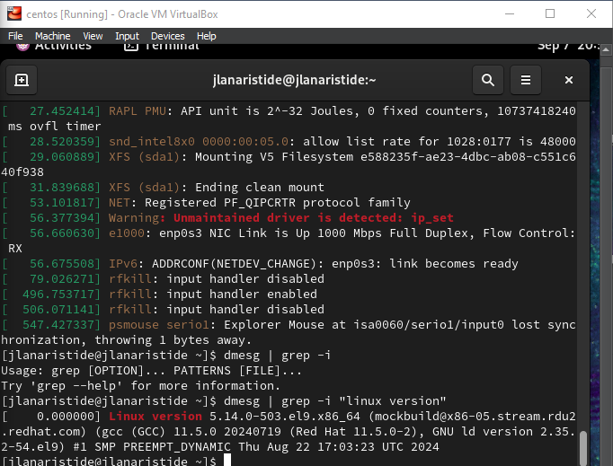
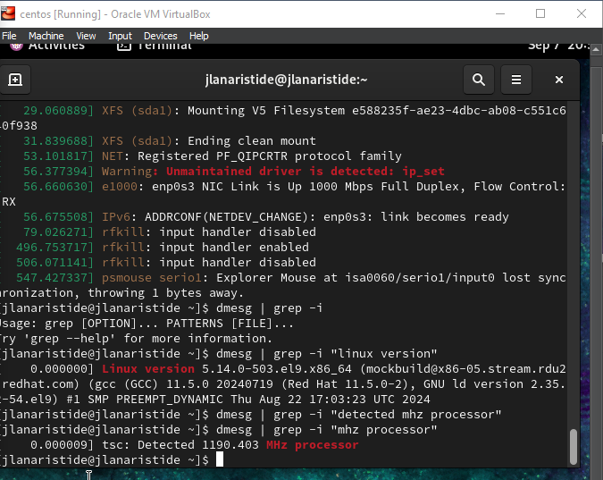
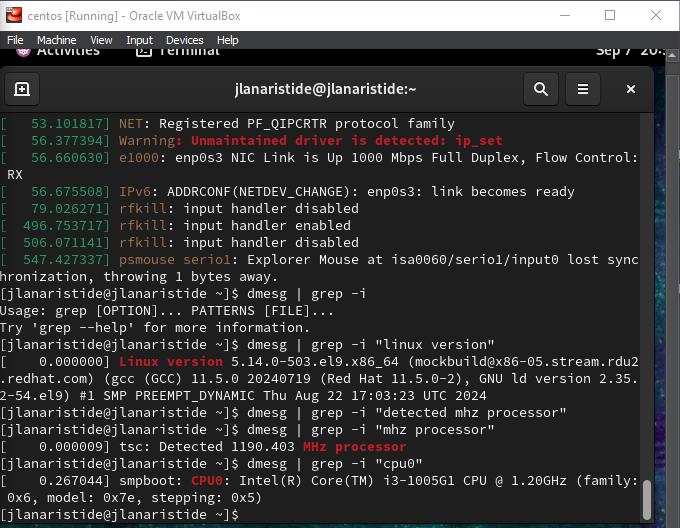
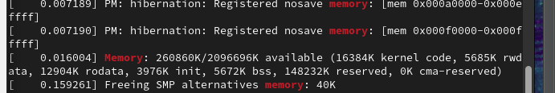
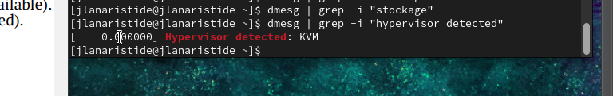
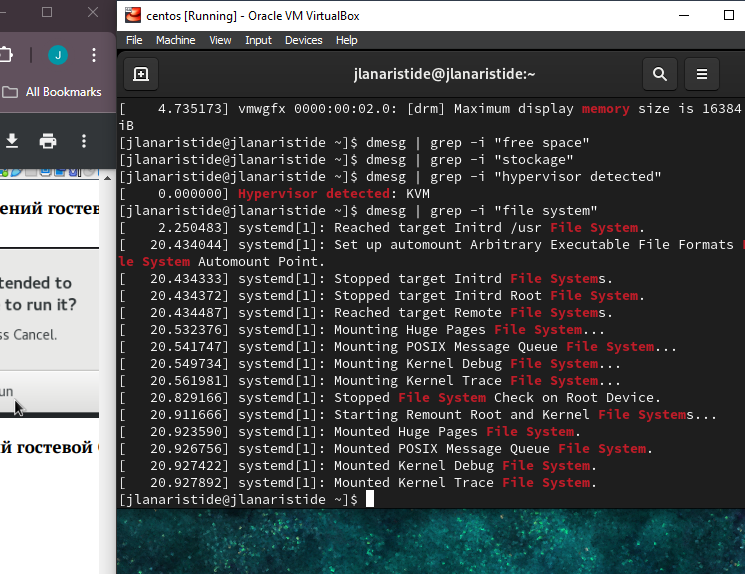

---
## Front matter
title: "Отчёта по лабораторной работе"
subtitle: "Лаб 1"
author: "Аристид Жан Лоэнс Аристобуль"

## Generic otions
lang: ru-RU
toc-title: "Содержание"

## Bibliography
bibliography: bib/cite.bib
csl: pandoc/csl/gost-r-7-0-5-2008-numeric.csl

## Pdf output format
toc: true # Table of contents
toc-depth: 2
lof: true # List of figures
lot: true # List of tables
fontsize: 12pt
linestretch: 1.5
papersize: a4
documentclass: scrreprt
## I18n polyglossia
polyglossia-lang:
  name: russian
  options:
	- spelling=modern
	- babelshorthands=true
polyglossia-otherlangs:
  name: english
## I18n babel
babel-lang: russian
babel-otherlangs: english
## Fonts
mainfont: IBM Plex Serif
romanfont: IBM Plex Serif
sansfont: IBM Plex Sans
monofont: IBM Plex Mono
mathfont: STIX Two Math
mainfontoptions: Ligatures=Common,Ligatures=TeX,Scale=0.94
romanfontoptions: Ligatures=Common,Ligatures=TeX,Scale=0.94
sansfontoptions: Ligatures=Common,Ligatures=TeX,Scale=MatchLowercase,Scale=0.94
monofontoptions: Scale=MatchLowercase,Scale=0.94,FakeStretch=0.9
mathfontoptions:
## Biblatex
biblatex: true
biblio-style: "gost-numeric"
biblatexoptions:
  - parentracker=true
  - backend=biber
  - hyperref=auto
  - language=auto
  - autolang=other*
  - citestyle=gost-numeric
## Pandoc-crossref LaTeX customization
figureTitle: "Рис."
tableTitle: "Таблица"
listingTitle: "Листинг"
lofTitle: "Список иллюстраций"
lotTitle: "Список таблиц"
lolTitle: "Листинги"
## Misc options
indent: true
header-includes:
  - \usepackage{indentfirst}
  - \usepackage{float} # keep figures where there are in the text
  - \floatplacement{figure}{H} # keep figures where there are in the text
---

# Цель работы

Целью данной работы является приобретение практических навыков установки операционной системы на виртуальную машину, настройки минимально необходимых для дальнейшей работы сервисов.

# Задание

Дождитесь загрузки графического окружения и откройте терминал. В окне терминала проанализируйте последовательность загрузки системы, выполнив команду dmesg. Можно просто просмотреть вывод этой команды:
dmesg | less

Можно использовать поиск с помощью grep:
dmesg | grep -i "то, что ищем"
Получите следующую информацию.

1. Версия ядра Linux (Linux version).
2. Частота процессора (Detected Mhz processor).
3. Модель процессора (CPU0).
4. Объем доступной оперативной памяти (Memory available).
5. Тип обнаруженного гипервизора (Hypervisor detected).
6. Тип файловой системы корневого раздела.
7. Последовательность монтирования файловых систем.

# Теоретическое введение

В вычислительной технике виртуальная машина (ВМ) — это виртуализация или эмуляция компьютерной системы. Виртуальные машины основаны на компьютерных архитектурах и обеспечивают функциональность физического компьютера. Их реализация может включать специализированное оборудование, программное обеспечение или комбинацию этих двух.

[@arch_virt_mach_book].

# Выполнение лабораторной работы

Установка и конфигурация virtual machine (рис. [-@fig:001]).

{#fig:001 width=70%}

Последовательность загрузки системы, выполнив команду dmesg (рис. [-@fig:002]).

{#fig:002 width=70%}

Версия ядра Linux (рис. [-@fig:003]).

{#fig:003 width=70%}

Частота процессора (рис. [-@fig:004]).

{#fig:004 width=70%}

Модель процессора (рис. [-@fig:005]).

{#fig:005 width=70%}

Объем доступной оперативной памяти (рис. [-@fig:006]).

{#fig:006 width=70%}

Тип обнаруженного гипервизора (рис. [-@fig:007]).

{#fig:007 width=70%}

Тип файловой системы корневого раздела (рис. [-@fig:008]).

{#fig:008 width=70%}

# Выводы

Благодаря виртуальной машине мы можем использовать параллельно с операционной системой нашего компьютера другую операционную систему, в данном случае Linux.

# Список литературы{.unnumbered}

::: {#refs}
:::
