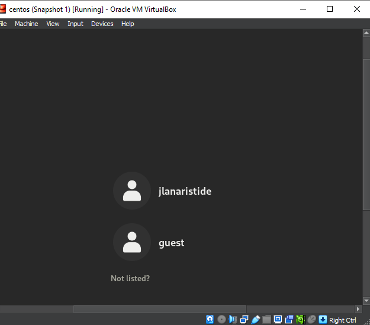
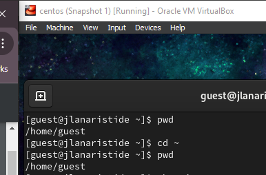
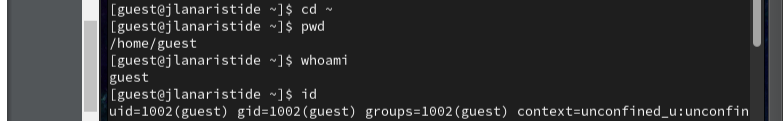
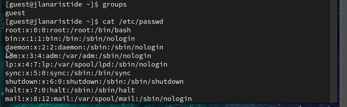
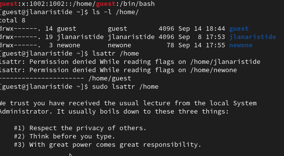
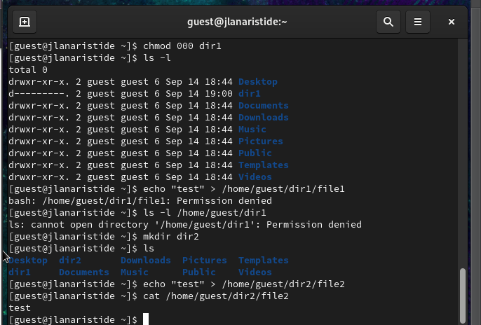

---
## Front matter
title: "Отчёт по лабораторной работе"
subtitle: "Лаб 2"
author: "Аристид Жан Лоэнс Аристобуль"

## Generic otions
lang: ru-RU
toc-title: "Содержание"

## Bibliography
bibliography: bib/cite.bib
csl: pandoc/csl/gost-r-7-0-5-2008-numeric.csl

## Pdf output format
toc: true # Table of contents
toc-depth: 2
lof: true # List of figures
lot: true # List of tables
fontsize: 12pt
linestretch: 1.5
papersize: a4
documentclass: scrreprt
## I18n polyglossia
polyglossia-lang:
  name: russian
  options:
	- spelling=modern
	- babelshorthands=true
polyglossia-otherlangs:
  name: english
## I18n babel
babel-lang: russian
babel-otherlangs: english
## Fonts
mainfont: IBM Plex Serif
romanfont: IBM Plex Serif
sansfont: IBM Plex Sans
monofont: IBM Plex Mono
mathfont: STIX Two Math
mainfontoptions: Ligatures=Common,Ligatures=TeX,Scale=0.94
romanfontoptions: Ligatures=Common,Ligatures=TeX,Scale=0.94
sansfontoptions: Ligatures=Common,Ligatures=TeX,Scale=MatchLowercase,Scale=0.94
monofontoptions: Scale=MatchLowercase,Scale=0.94,FakeStretch=0.9
mathfontoptions:
## Biblatex
biblatex: true
biblio-style: "gost-numeric"
biblatexoptions:
  - parentracker=true
  - backend=biber
  - hyperref=auto
  - language=auto
  - autolang=other*
  - citestyle=gost-numeric
## Pandoc-crossref LaTeX customization
figureTitle: "Рис."
tableTitle: "Таблица"
listingTitle: "Листинг"
lofTitle: "Список иллюстраций"
lotTitle: "Список таблиц"
lolTitle: "Листинги"
## Misc options
indent: true
header-includes:
  - \usepackage{indentfirst}
  - \usepackage{float} # keep figures where there are in the text
  - \floatplacement{figure}{H} # keep figures where there are in the text
---

# Цель работы

Получение практических навыков работы в консоли с атрибутами файлов, закрепление теоретических основ дискреционного разграничения доступа в современных системах с открытым кодом на базе ОС Linux.

# Задание

Постарайтесь последовательно выполнить все пункты, занося ваши ответы на поставленные вопросы и замечания в отчёт.

1. В установленной при выполнении предыдущей лабораторной работы
   операционной системе создайте учётную запись пользователя guest (использую учётную запись администратора):
   useradd guest
2. Задайте пароль для пользователя guest (использую учётную запись администратора):
   passwd guest
3. Войдите в систему от имени пользователя guest.
4. Определите директорию, в которой вы находитесь, командой pwd. Сравните её с приглашением командной строки. Определите, является ли она
   вашей домашней директорией? Если нет, зайдите в домашнюю директорию.
5. Уточните имя вашего пользователя командой whoami.
6. Уточните имя вашего пользователя, его группу, а также группы, куда входит пользователь, командой id. Выведенные значения uid, gid и др. запомните. Сравните вывод id с выводом команды groups.
7. Сравните полученную информацию об имени пользователя с данными,
   выводимыми в приглашении командной строки.
8. Просмотрите файл /etc/passwd командой
   cat /etc/passwd
   Найдите в нём свою учётную запись. Определите uid пользователя.
   Определите gid пользователя. Сравните найденные значения с полученными в предыдущих пунктах.
   Замечание: в случае, когда вывод команды не умещается на одном
   экране монитора, используйте прокрутку вверх–вниз (удерживая клавишу shift, нажимайте page up и page down) либо программу grep в

# Теоретическое введение

Интерфейс командной строки (CLI) — это средство взаимодействия с компьютерной программой путем ввода строк текста, называемых командными строками. Интерфейсы командной строки появились в середине 1960-х годов на компьютерных терминалах как интерактивная и более удобная альтернатива неинтерактивному интерфейсу, доступному с помощью перфокарт.
[@linux_command_line]

# Выполнение лабораторной работы

В установленной при выполнении предыдущей лабораторной работыоперационной системе создайте учётную запись пользователя guest (использую учётную запись администратора)
useradd guest (рис. [-@fig:001]).

{#fig:001 width=70%}

Задайте пароль для пользователя guest (использую учётную запись администратора):
passwd guest (рис. [-@fig:002]).

{#fig:002 width=70%}

Войдите в систему от имени пользователя guest (рис. [-@fig:003]).

{#fig:003 width=70%}

Определите директорию, в которой вы находитесь, командой pwd. Сравните её с приглашением командной строки. Определите, является ли она вашей домашней директорией? Если нет, зайдите в домашнюю директорию .

Ответ: Я нахожусь в /home/guest. Да, она моя домашная директория (рис. [-@fig:004]).

{#fig:004 width=70%}

Уточните имя вашего пользователя командой whoami.
Уточните имя вашего пользователя, его группу, а также группы, куда входит пользователь, командой id. Выведенные значения uid, gid и др. запомните. Сравните вывод id с выводом команды groups.

Ответ: имя вашего пользователя = guest, группа = 1002, gid = 1002, uid = 1002 (рис. [-@fig:005]).

{#fig:005 width=70%}

Просмотрите файл /etc/passwd командой cat /etc/passwd (рис. [-@fig:006]).

{#fig:006 width=70%}

Определите существующие в системе директории командой ls -l /home
Ответ: Да, существует.

Создайте в домашней директории поддиректорию dir1 командой
mkdir dir1
Определите командами ls -l и lsattr, какие права доступа и расширенные атрибуты были выставлены на директорию dir1.
Снимите с директории dir1 все атрибуты командой
chmod 000 dir1 (рис. [-@fig:007]).

{#fig:007 width=70%}

Попытайтесь создать в директории dir1 файл file1 командой
echo "test" > /home/guest/dir1/file1
Объясните, почему вы получили отказ в выполнении операции по созданию файла?
Оцените, как сообщение об ошибке отразилось на создании файла? Проверьте командой
ls -l /home/guest/dir1 (рис. [-@fig:008]).

{#fig:008 width=70%}

# Выводы

В этой лабораторной работе мы научились выполнять некоторые операции с терминалом Linux, такие как создание новой учетной записи пользователя, изменение атрибутов некоторых файлов.

# Список литературы{.unnumbered}

::: {#refs}
:::
