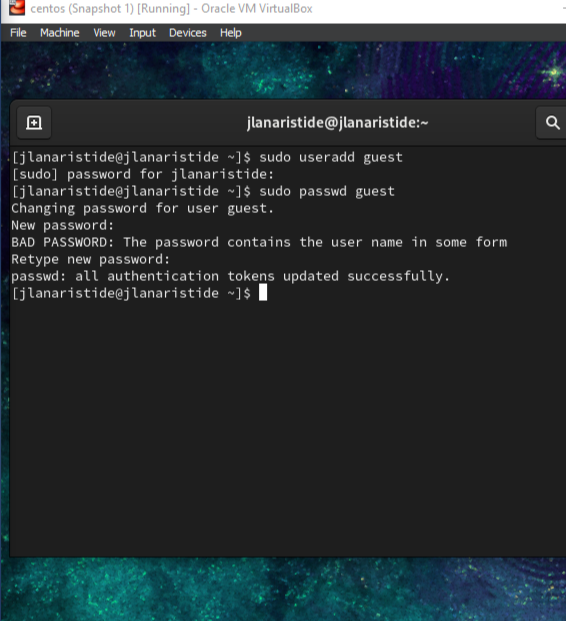

---
## Front matter
lang: ru-RU
title: Презентация Лаб
subtitle: Лаб 3
author:
  - Аристид Ж. Л.
institute:
  - Российский университет дружбы народов, Москва, Россия
date: 08 september 2024

## i18n babel
babel-lang: russian
babel-otherlangs: english

## Formatting pdf
toc: false
toc-title: Содержание
slide_level: 2
aspectratio: 169
section-titles: true
theme: metropolis
header-includes:
  - \metroset{progressbar=frametitle,sectionpage=progressbar,numbering=fraction}
---

# Информация

## Докладчик

:::::::::::::: {.columns align=center}
::: {.column width="70%"}

- Аристид Жан Лоэнс
- Студент
- Российский университет дружбы народов

:::
::::::::::::::

# Вводная часть

## Объект и предмет исследования

- Linux
- Virtual Machine
- Linux Console
- New User Account
- атрибуты

## Цели и задачи

- Получение практических навыков работы в консоли с атрибутами файлов для групп пользователей.

# Результаты

## Создание учётной запись пользователя

создайте учётную запись пользователя (рис. [-@fig:001]).

{#fig:001 width=70%}

## Команд gpasswd

Команд gpasswd (рис. [-@fig:002]).

{#fig:002 width=70%}

## Команд groups

Команд groups (рис. [-@fig:003]).

{#fig:003 width=70%}

## Команд cat

команд cat (рис. [-@fig:004]).

{#fig:004 width=70%}

## Команд newgrp

Команд newgrp (рис. [-@fig:005]).

{#fig:005 width=70%}

## Команд chmod

Команд chmod (рис. [-@fig:006]).

{#fig:006 width=70%}

# Итоговый слайд

В этой лабораторной работе мы научились выполнять некоторые операции с терминалом Linux, такие как создание новой учетной записи пользователя, изменение атрибутов некоторых файлов.
