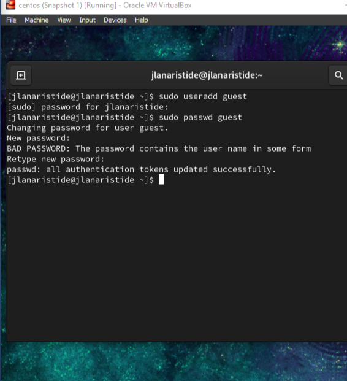
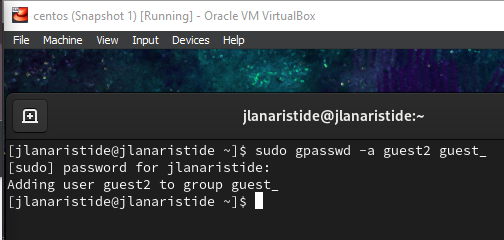
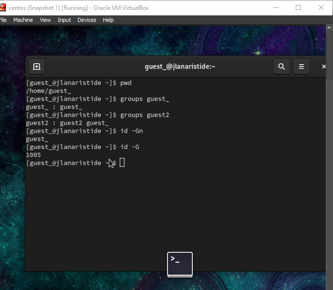
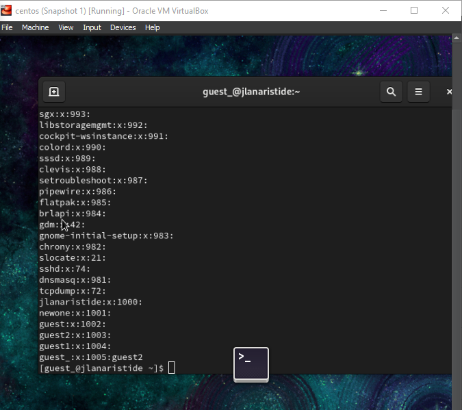
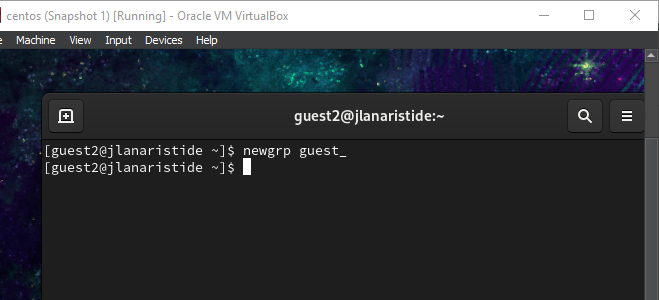

---
## Front matter
title: "Отчёт по лабораторной работе"
subtitle: "Лаб 3"
author: "Аристид Жан Лоэнс Аристобуль"

## Generic otions
lang: ru-RU
toc-title: "Содержание"

## Bibliography
bibliography: bib/cite.bib
csl: pandoc/csl/gost-r-7-0-5-2008-numeric.csl

## Pdf output format
toc: true # Table of contents
toc-depth: 2
lof: true # List of figures
lot: true # List of tables
fontsize: 12pt
linestretch: 1.5
papersize: a4
documentclass: scrreprt
## I18n polyglossia
polyglossia-lang:
  name: russian
  options:
	- spelling=modern
	- babelshorthands=true
polyglossia-otherlangs:
  name: english
## I18n babel
babel-lang: russian
babel-otherlangs: english
## Fonts
mainfont: IBM Plex Serif
romanfont: IBM Plex Serif
sansfont: IBM Plex Sans
monofont: IBM Plex Mono
mathfont: STIX Two Math
mainfontoptions: Ligatures=Common,Ligatures=TeX,Scale=0.94
romanfontoptions: Ligatures=Common,Ligatures=TeX,Scale=0.94
sansfontoptions: Ligatures=Common,Ligatures=TeX,Scale=MatchLowercase,Scale=0.94
monofontoptions: Scale=MatchLowercase,Scale=0.94,FakeStretch=0.9
mathfontoptions:
## Biblatex
biblatex: true
biblio-style: "gost-numeric"
biblatexoptions:
  - parentracker=true
  - backend=biber
  - hyperref=auto
  - language=auto
  - autolang=other*
  - citestyle=gost-numeric
## Pandoc-crossref LaTeX customization
figureTitle: "Рис."
tableTitle: "Таблица"
listingTitle: "Листинг"
lofTitle: "Список иллюстраций"
lotTitle: "Список таблиц"
lolTitle: "Листинги"
## Misc options
indent: true
header-includes:
  - \usepackage{indentfirst}
  - \usepackage{float} # keep figures where there are in the text
  - \floatplacement{figure}{H} # keep figures where there are in the text
---

# Цель работы

Получение практических навыков работы в консоли с атрибутами файлов для групп пользователей.

# Задание

1. В установленной операционной системе создайте учётную запись пользователя guest (использую учётную запись администратора):
   useradd guest
2. Задайте пароль для пользователя guest (использую учётную запись администратора):
   passwd guest
3. Аналогично создайте второго пользователя guest2.
4. Добавьте пользователя guest2 в группу guest:
   gpasswd -a guest2 guest
5. Осуществите вход в систему от двух пользователей на двух разных консолях: guest на первой консоли и guest2 на второй консоли.
6. Для обоих пользователей командой pwd определите директорию, в которой вы находитесь. Сравните её с приглашениями командной строки.
7. Уточните имя вашего пользователя, его группу, кто входит в неё
   и к каким группам принадлежит он сам. Определите командами
   groups guest и groups guest2, в какие группы входят пользователи guest и guest2. Сравните вывод команды groups с выводом команд
   id -Gn и id -G.
8. Сравните полученную информацию с содержимым файла /etc/group.
   Просмотрите файл командой
   cat /etc/group
9. От имени пользователя guest2 выполните регистрацию пользователя
   guest2 в группе guest командой
   newgrp guest
10. От имени пользователя guest измените права директории /home/guest,
    разрешив все действия для пользователей группы:
    chmod g+rwx /home/guest
11. От имени пользователя guest снимите с директории /home/guest/dir1
    все атрибуты командой
    chmod 000 dirl

# Теоретическое введение

Интерфейс командной строки (CLI) — это средство взаимодействия с компьютерной программой путем ввода строк текста, называемых командными строками. Интерфейсы командной строки появились в середине 1960-х годов на компьютерных терминалах как интерактивная и более удобная альтернатива неинтерактивному интерфейсу, доступному с помощью перфокарт.
[@linux_command_line]

# Выполнение лабораторной работы

В установленной при выполнении предыдущей лабораторной работыоперационной системе создайте учётную запись пользователя guest (использую учётную запись администратора)
useradd guest (рис. [-@fig:001]).

{#fig:001 width=70%}

Задайте пароль для пользователя guest (использую учётную запись администратора):
passwd guest (рис. [-@fig:002]).

{#fig:002 width=70%}

Добавьте пользователя guest2 в группу guest:
gpasswd -a guest2 guest (рис. [-@fig:003]).

{#fig:003 width=70%}

Уточните имя вашего пользователя, его группу, кто входит в неё
и к каким группам принадлежит он сам. Определите командами
groups guest и groups guest2, в какие группы входят пользователи guest и guest2. Сравните вывод команды groups с выводом команд
id -Gn и id -G. (рис. [-@fig:004]).

{#fig:004 width=70%}

Сравните полученную информацию с содержимым файла /etc/group.
Просмотрите файл командой
cat /etc/group (рис. [-@fig:005]).

{#fig:005 width=70%}

От имени пользователя guest2 выполните регистрацию пользователя guest2 в группе guest командой newgrp guest. (рис. [-@fig:006])

{#fig:006 width=70%}

От имени пользователя guest снимите с директории /home/guest/dir1 все атрибуты командой и проверьте правильность снятия атрибутов (рис. [-@fig:007]).

# Выводы

В этой лабораторной работе мы научились выполнять некоторые операции с терминалом Linux, такие как создание новой учетной записи пользователя, изменение атрибутов некоторых файлов.

# Список литературы{.unnumbered}

::: {#refs}
:::
