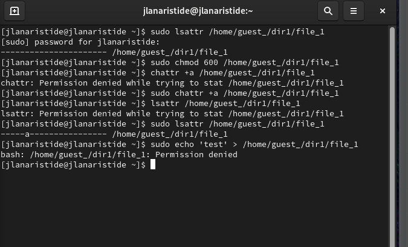
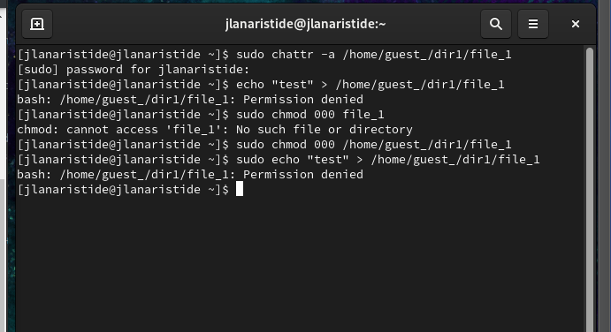
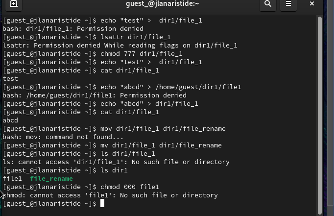

---
## Front matter
title: "Отчёт по лабораторной работе"
subtitle: "Лаб 4"
author: "Аристид Жан Лоэнс Аристобуль"

## Generic otions
lang: ru-RU
toc-title: "Содержание"

## Bibliography
bibliography: bib/cite.bib
csl: pandoc/csl/gost-r-7-0-5-2008-numeric.csl

## Pdf output format
toc: true # Table of contents
toc-depth: 2
lof: true # List of figures
lot: true # List of tables
fontsize: 12pt
linestretch: 1.5
papersize: a4
documentclass: scrreprt
## I18n polyglossia
polyglossia-lang:
  name: russian
  options:
	- spelling=modern
	- babelshorthands=true
polyglossia-otherlangs:
  name: english
## I18n babel
babel-lang: russian
babel-otherlangs: english
## Fonts
mainfont: IBM Plex Serif
romanfont: IBM Plex Serif
sansfont: IBM Plex Sans
monofont: IBM Plex Mono
mathfont: STIX Two Math
mainfontoptions: Ligatures=Common,Ligatures=TeX,Scale=0.94
romanfontoptions: Ligatures=Common,Ligatures=TeX,Scale=0.94
sansfontoptions: Ligatures=Common,Ligatures=TeX,Scale=MatchLowercase,Scale=0.94
monofontoptions: Scale=MatchLowercase,Scale=0.94,FakeStretch=0.9
mathfontoptions:
## Biblatex
biblatex: true
biblio-style: "gost-numeric"
biblatexoptions:
  - parentracker=true
  - backend=biber
  - hyperref=auto
  - language=auto
  - autolang=other*
  - citestyle=gost-numeric
## Pandoc-crossref LaTeX customization
figureTitle: "Рис."
tableTitle: "Таблица"
listingTitle: "Листинг"
lofTitle: "Список иллюстраций"
lotTitle: "Список таблиц"
lolTitle: "Листинги"
## Misc options
indent: true
header-includes:
  - \usepackage{indentfirst}
  - \usepackage{float} # keep figures where there are in the text
  - \floatplacement{figure}{H} # keep figures where there are in the text
---

# Цель работы

Получение практических навыков работы в консоли с расширенными атрибутами файлов

# Задание

1. От имени пользователя guest определите расширенные атрибуты файла
   /home/guest/dir1/file1 командой
   lsattr /home/guest/dir1/file1
2. Установите командой
   chmod 600 file1
   на файл file1 права, разрешающие чтение и запись для владельца файла.
3. Попробуйте установить на файл /home/guest/dir1/file1 расширенный атрибут a от имени пользователя guest:
   chattr +a /home/guest/dir1/file1
   В ответ вы должны получить отказ от выполнения операции.
4. Зайдите на третью консоль с правами администратора либо повысьте
   свои права с помощью команды su. Попробуйте установить расширенный атрибут a на файл /home/guest/dir1/file1 от имени суперпользователя:
   chattr +a /home/guest/dir1/file1
5. От пользователя guest проверьте правильность установления атрибута:
   lsattr /home/guest/dir1/file1
6. Выполните дозапись в файл file1 слова «test» командой
   echo "test" /home/guest/dir1/file1
   После этого выполните чтение файла file1 командой
   cat /home/guest/dir1/file1
   Убедитесь, что слово test было успешно записано в file1.
7. Попробуйте удалить файл file1 либо стереть имеющуюся в нём информацию командой
   echo "abcd" > /home/guest/dirl/file1
   Попробуйте переименовать файл.
8. Попробуйте с помощью команды
   chmod 000 file1
   установить на файл file1 права, например, запрещающие чтение и запись для владельца файла. Удалось ли вам успешно выполнить указанные команды?
9. Снимите расширенный атрибут a с файла /home/guest/dirl/file1 от
   имени суперпользователя командой
   chattr -a /home/guest/dir1/file1
   Повторите операции, которые вам ранее не удавалось выполнить. Ваши
   наблюдения занесите в отчёт.
10. Повторите ваши действия по шагам, заменив атрибут «a» атрибутом «i».
    Удалось ли вам дозаписать информацию в файл? Ваши наблюдения занесите в отчёт.

# Теоретическое введение

Интерфейс командной строки (CLI) — это средство взаимодействия с компьютерной программой путем ввода строк текста, называемых командными строками. Интерфейсы командной строки появились в середине 1960-х годов на компьютерных терминалах как интерактивная и более удобная альтернатива неинтерактивному интерфейсу, доступному с помощью перфокарт.
[@linux_command_line]

# Выполнение лабораторной работы

От имени пользователя guest определите расширенные атрибуты файла
/home/guest/dir1/file1 командой
lsattr /home/guest/dir1/file1 (рис. [-@fig:001]).

{#fig:001 width=70%}

Попробуйте установить на файл /home/guest/dir1/file1 расширенный атрибут a от имени пользователя guest:
chattr +a /home/guest/dir1/file1 (рис. [-@fig:002]).

{#fig:002 width=70%}

Выполните дозапись в файл file1 слова «test» командой
echo "test" /home/guest/dir1/file1
После этого выполните чтение файла file1 командой
cat /home/guest/dir1/file1 (рис. [-@fig:003]).

{#fig:003 width=70%}

Снимите расширенный атрибут a с файла /home/guest/dirl/file1 от имени суперпользователя командой
chattr -a /home/guest/dir1/file1 (рис. [-@fig:004]).

{#fig:004 width=70%}

Повторите ваши действия по шагам, заменив атрибут «a» атрибутом «i».
Удалось ли вам дозаписать информацию в файл? Ваши наблюдения занесите в отчёт. (рис. [-@fig:005]).

{#fig:005 width=70%}

# Выводы

В этой лабораторной работе мы научились выполнять некоторые операции с терминалом Linux, такие как создание новой учетной записи пользователя, изменение атрибутов некоторых файлов.

# Список литературы{.unnumbered}

::: {#refs}
:::
