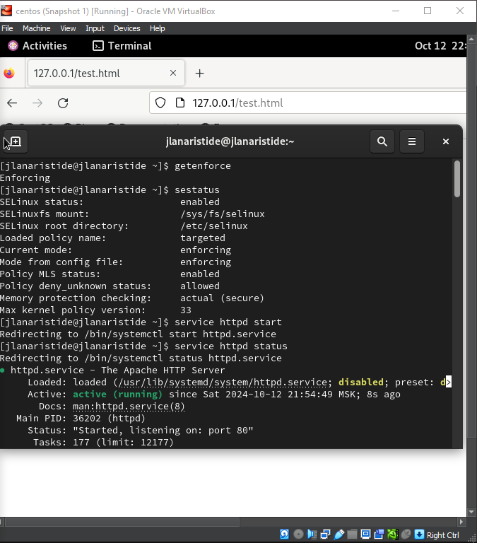
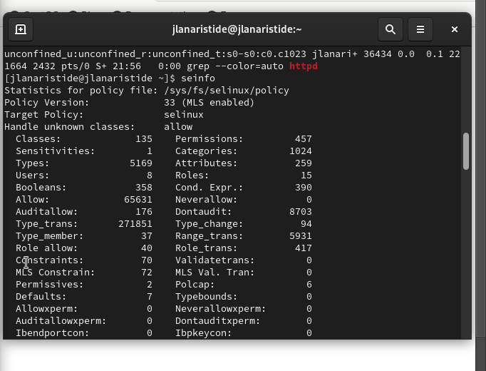
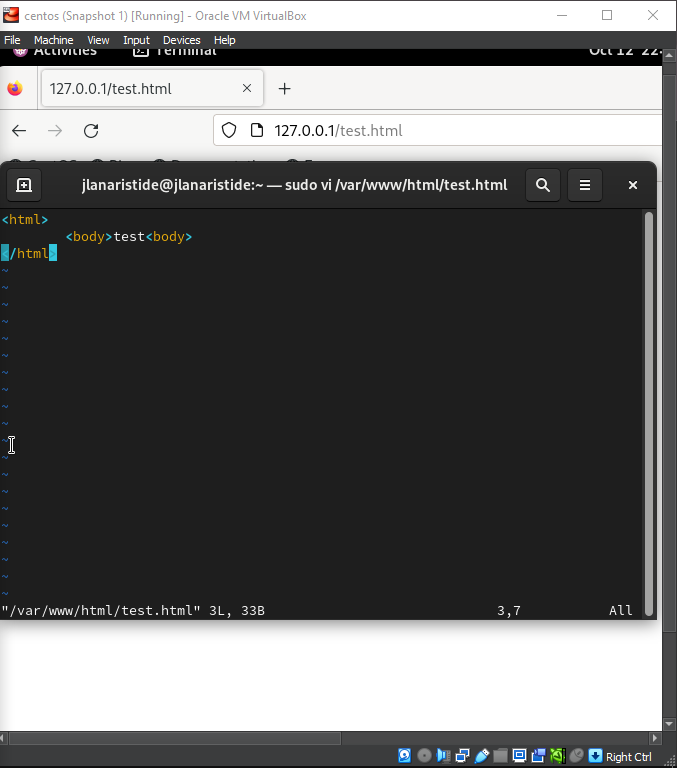
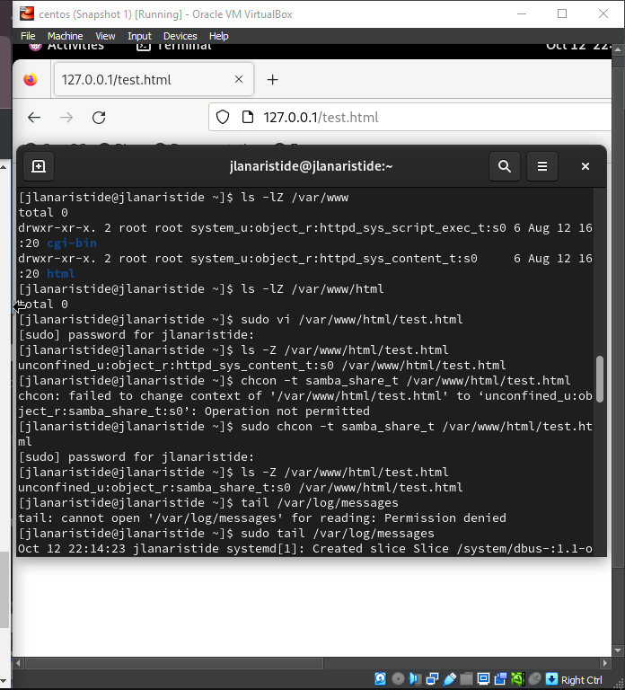
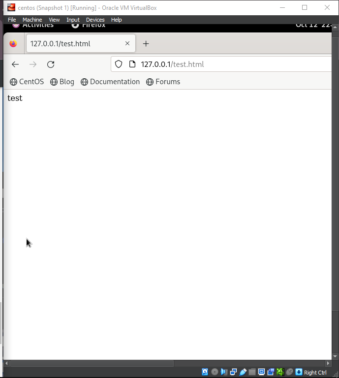
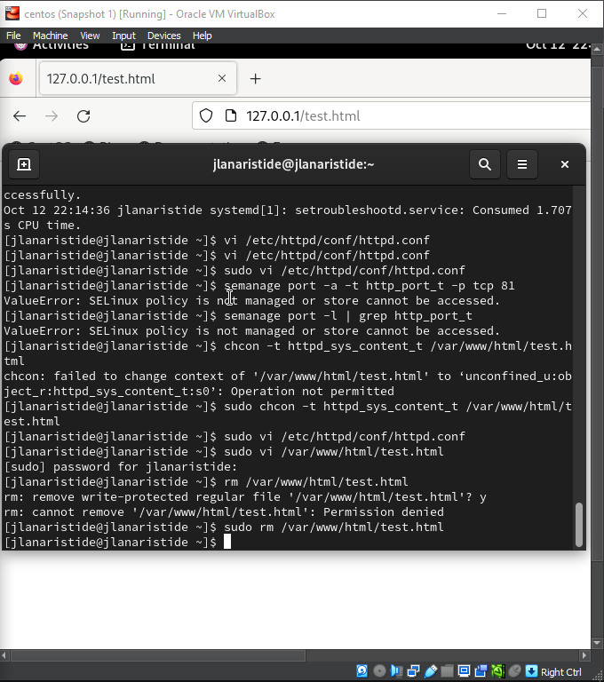

---
## Front matter
lang: ru-RU
title: Презентация Лаб
subtitle: Лаб 6
author:
  - Аристид Ж. Л.
institute:
  - Российский университет дружбы народов, Москва, Россия
date: 08 september 2024

## i18n babel
babel-lang: russian
babel-otherlangs: english

## Formatting pdf
toc: false
toc-title: Содержание
slide_level: 2
aspectratio: 169
section-titles: true
theme: metropolis
header-includes:
  - \metroset{progressbar=frametitle,sectionpage=progressbar,numbering=fraction}
---

# Информация

## Докладчик

:::::::::::::: {.columns align=center}
::: {.column width="70%"}

- Аристид Жан Лоэнс
- Студент
- Российский университет дружбы народов

:::
::::::::::::::

# Вводная часть

## Объект и предмет исследования

- Linux
- Virtual Machine
- Linux Console
- SELinux
- Apache
- Web Browser

## Цели и задачи

- Развить навыки администрирования ОС Linux. Получить первое практическое знакомство с технологией SELinux1.
  Проверить работу SELinx на практике совместно с веб-сервером Apache

# Результаты

## Activation web server Apache

. Обратитесь с помощью браузера к веб-серверу, запущенному на вашем компьютере, и убедитесь, что последний работает:
service httpd status
или
/etc/rc.d/init.d/httpd status
(рис. [-@fig:001]).

{#fig:001 width=70%}

## Команд seinfo

Посмотрите статистику по политике с помощью команды seinfo, также
определите множество пользователей, ролей, типов (рис. [-@fig:002]).

{#fig:002 width=70%}

## html file

Создайте от имени суперпользователя (так как в дистрибутиве после установки только ему разрешена запись в директорию) html-файл
/var/www/html/test.html следующего содержания:
(рис. [-@fig:003]).

{#fig:003 width=70%}

## Context file

Проверить контекст файла можно командой ls -Z.
ls -Z /var/www/html/test.html. (рис. [-@fig:005]).

{#fig:005 width=70%}

{width=70%}

## change context file

chcon -t samba_share_t /var/www/html/test.html
ls -Z /var/www/html/test.html (рис. [-@fig:006]).

{#fig:006 width=70%}

# Итоговый слайд

В этой лабораторной работе мы научились выполнять некоторые операции с терминалом Linux, также мы работали с SElinux и web-server Apache.
