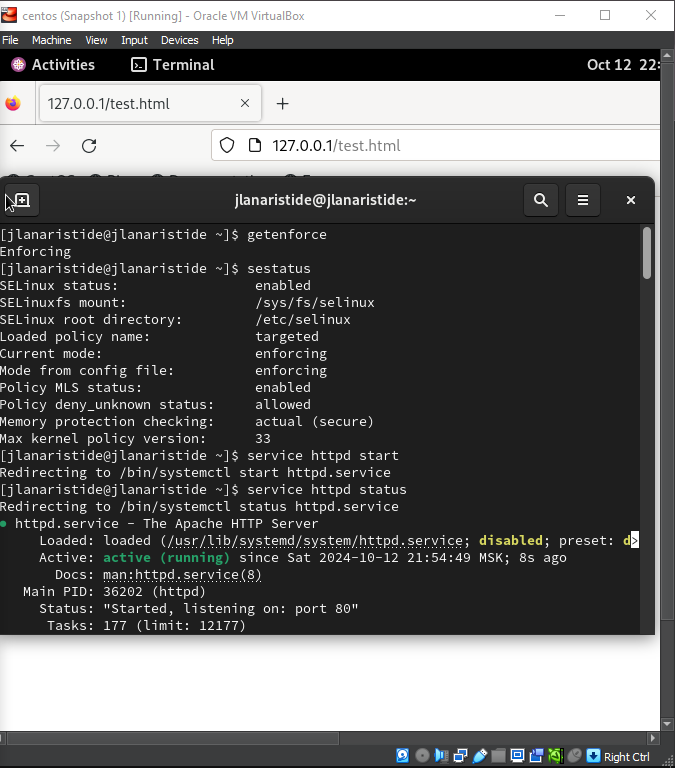
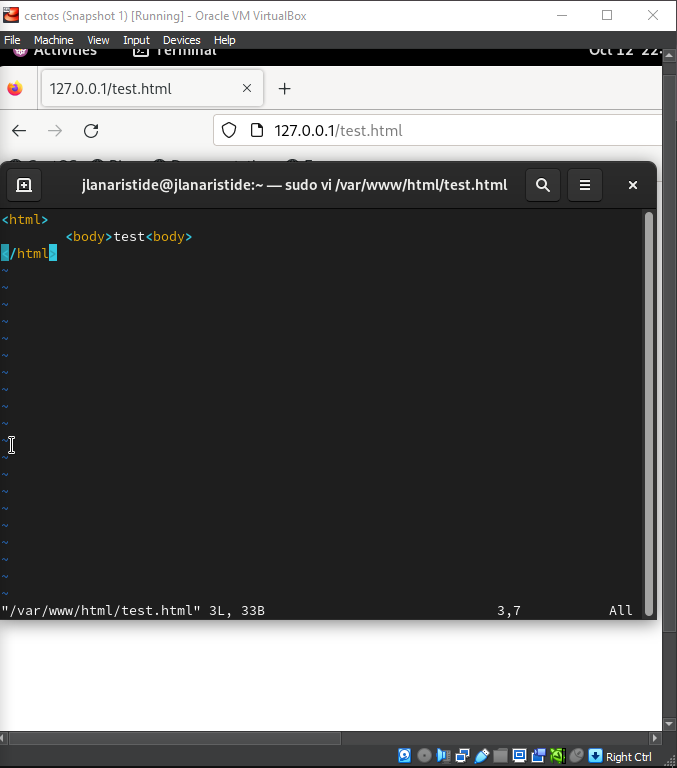
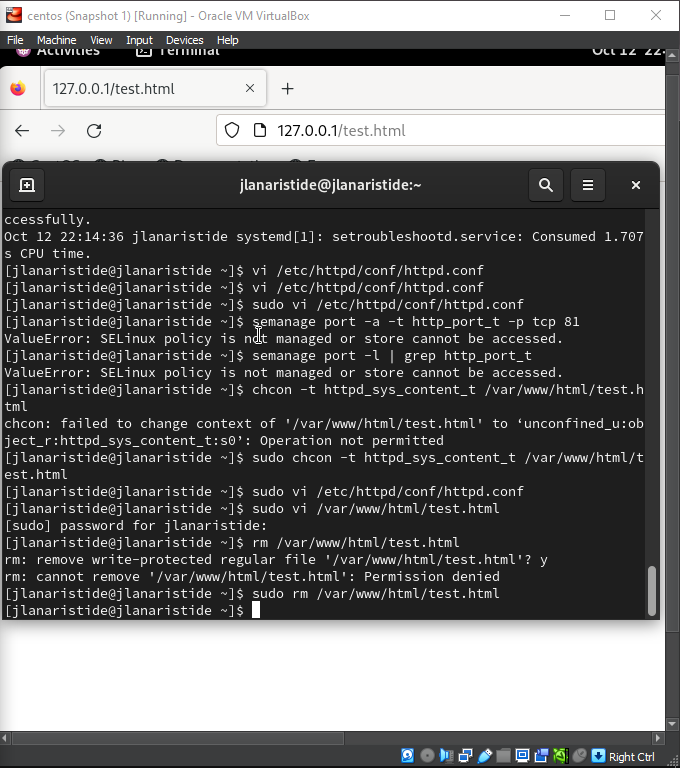

---
## Front matter
title: "Отчёт по лабораторной работе"
subtitle: "Лаб 6"
author: "Аристид Жан Лоэнс Аристобуль"

## Generic otions
lang: ru-RU
toc-title: "Содержание"

## Bibliography
bibliography: bib/cite.bib
csl: pandoc/csl/gost-r-7-0-5-2008-numeric.csl

## Pdf output format
toc: true # Table of contents
toc-depth: 2
lof: true # List of figures
lot: true # List of tables
fontsize: 12pt
linestretch: 1.5
papersize: a4
documentclass: scrreprt
## I18n polyglossia
polyglossia-lang:
  name: russian
  options:
	- spelling=modern
	- babelshorthands=true
polyglossia-otherlangs:
  name: english
## I18n babel
babel-lang: russian
babel-otherlangs: english
## Fonts
mainfont: IBM Plex Serif
romanfont: IBM Plex Serif
sansfont: IBM Plex Sans
monofont: IBM Plex Mono
mathfont: STIX Two Math
mainfontoptions: Ligatures=Common,Ligatures=TeX,Scale=0.94
romanfontoptions: Ligatures=Common,Ligatures=TeX,Scale=0.94
sansfontoptions: Ligatures=Common,Ligatures=TeX,Scale=MatchLowercase,Scale=0.94
monofontoptions: Scale=MatchLowercase,Scale=0.94,FakeStretch=0.9
mathfontoptions:
## Biblatex
biblatex: true
biblio-style: "gost-numeric"
biblatexoptions:
  - parentracker=true
  - backend=biber
  - hyperref=auto
  - language=auto
  - autolang=other*
  - citestyle=gost-numeric
## Pandoc-crossref LaTeX customization
figureTitle: "Рис."
tableTitle: "Таблица"
listingTitle: "Листинг"
lofTitle: "Список иллюстраций"
lotTitle: "Список таблиц"
lolTitle: "Листинги"
## Misc options
indent: true
header-includes:
  - \usepackage{indentfirst}
  - \usepackage{float} # keep figures where there are in the text
  - \floatplacement{figure}{H} # keep figures where there are in the text
---

# Цель работы

Развить навыки администрирования ОС Linux. Получить первое практическое знакомство с технологией SELinux1.
Проверить работу SELinx на практике совместно с веб-сервером
Apache

# Задание

1. Войдите в систему с полученными учётными данными и убедитесь, что
   SELinux работает в режиме enforcing политики targeted с помощью команд getenforce и sestatus.
2. Обратитесь с помощью браузера к веб-серверу, запущенному на вашем
   компьютере, и убедитесь, что последний работает:
   service httpd status
   или
   /etc/rc.d/init.d/httpd status
   Если не работает, запустите его так же, но с параметром start.
3. Найдите веб-сервер Apache в списке процессов, определите его контекст
   безопасности и занесите эту информацию в отчёт. Например, можно использовать команду
   ps auxZ | grep httpd
   или
   ps -eZ | grep httpd
4. Посмотрите текущее состояние переключателей SELinux для Apache с
   помощью команды
   sestatus -bigrep httpd
   Обратите внимание, что многие из них находятся в положении «off».
5. Посмотрите статистику по политике с помощью команды seinfo, также
   определите множество пользователей, ролей, типов.
6. Определите тип файлов и поддиректорий, находящихся в директории
   /var/www, с помощью команды
   ls -lZ /var/www
7. Определите тип файлов, находящихся в директории /var/www/html:
   ls -lZ /var/www/html
8. Определите круг пользователей, которым разрешено создание файлов в
   директории /var/www/html.
9. Создайте от имени суперпользователя (так как в дистрибутиве после установки только ему разрешена запись в директорию) html-файл
   /var/www/html/test.html следующего содержания:

```html
<html>
  <body>
    test
  </body>
</html>
```

10. Проверьте контекст созданного вами файла. Занесите в отчёт контекст,
    присваиваемый по умолчанию вновь созданным файлам в директории
    /var/www/html.
11. Обратитесь к файлу через веб-сервер, введя в браузере адрес
    http://127.0.0.1/test.html. Убедитесь, что файл был успешно отображён.
12. Изучите справку man httpd_selinux и выясните, какие контексты файлов определены для httpd. Сопоставьте их с типом файла
    test.html. Проверить контекст файла можно командой ls -Z.
    ls -Z /var/www/html/test.html
13. Измените контекст файла /var/www/html/test.html с
    httpd_sys_content_t на любой другой, к которому процесс httpd не
    должен иметь доступа, например, на samba_share_t:
    chcon -t samba_share_t /var/www/html/test.html
    ls -Z /var/www/html/test.html
14. Попробуйте ещё раз получить доступ к файлу через веб-сервер, введя в
    браузере адрес http://127.0.0.1/test.html. Вы должны получить
    сообщение об ошибке:
    Forbidden
    You don't have permission to access /test.html on this server.
15. Проанализируйте ситуацию. Почему файл не был отображён, если права
    доступа позволяют читать этот файл любому пользователю?
    ls -l /var/www/html/test.html
    Просмотрите log-файлы веб-сервера Apache. Также просмотрите системный лог-файл:
    tail /var/log/messages
    Если в системе окажутся запущенными процессы setroubleshootd и
    audtd, то вы также сможете увидеть ошибки, аналогичные указанным
    выше, в файле /var/log/audit/audit.log. Проверьте это утверждение самостоятельно.
16. Попробуйте запустить веб-сервер Apache на прослушивание ТСР-порта
    81 (а не 80, как рекомендует IANA и прописано в /etc/services). Для
    этого в файле /etc/httpd/httpd.conf найдите строчку Listen 80 и
    замените её на Listen 81.
17. Выполните перезапуск веб-сервера Apache. Произошёл сбой? Поясните
    почему?
18. Проанализируйте лог-файлы:
    tail -nl /var/log/messages
    Просмотрите файлы /var/log/http/error_log,
    /var/log/http/access_log и /var/log/audit/audit.log и
    выясните, в каких файлах появились записи.
19. Выполните команду
    semanage port -a -t http_port_t -р tcp 81
    После этого проверьте список портов командой
    semanage port -l | grep http_port_t
    Убедитесь, что порт 81 появился в списке.
20. Попробуйте запустить веб-сервер Apache ещё раз. Поняли ли вы, почему
    он сейчас запустился, а в предыдущем случае не смог?
21. Верните контекст httpd_sys_cоntent\_\_t к файлу /var/www/html/ test.html:
    chcon -t httpd_sys_content_t /var/www/html/test.html
    После этого попробуйте получить доступ к файлу через веб-сервер, введя в браузере адрес http://127.0.0.1:81/test.html.
    Вы должны увидеть содержимое файла — слово «test».
22. Исправьте обратно конфигурационный файл apache, вернув Listen 80.
23. Удалите привязку http_port_t к 81 порту:
    semanage port -d -t http_port_t -p tcp 81
    и проверьте, что порт 81 удалён.
24. Удалите файл /var/www/html/test.html:
    rm /var/www/html/test.html

# Теоретическое введение

Security-Enhanced Linux (SELinux) — это модуль безопасности ядра Linux, который обеспечивает механизм поддержки политик безопасности контроля доступа, включая обязательный контроль доступа (MAC).

SELinux — это набор модификаций ядра и инструментов пользовательского пространства, добавленных в различные дистрибутивы Linux. Его архитектура стремится отделить применение решений по безопасности от политики безопасности и оптимизирует количество программного обеспечения, задействованного в реализации политики безопасности. Ключевые концепции, лежащие в основе SELinux, можно проследить до нескольких более ранних проектов Агентства национальной безопасности США (АНБ).

# Выполнение лабораторной работы

. Обратитесь с помощью браузера к веб-серверу, запущенному на вашем
компьютере, и убедитесь, что последний работает:
service httpd status
или
/etc/rc.d/init.d/httpd status
(рис. [-@fig:001]).

{#fig:001 width=70%}

Посмотрите статистику по политике с помощью команды seinfo, также
определите множество пользователей, ролей, типов (рис. [-@fig:002]).

{#fig:002 width=70%}

Создайте от имени суперпользователя (так как в дистрибутиве после установки только ему разрешена запись в директорию) html-файл
/var/www/html/test.html следующего содержания:
(рис. [-@fig:003]).

{#fig:003 width=70%}

Обратитесь к файлу через веб-сервер, введя в браузере адрес http://127.0.0.1/test.html. Убедитесь, что файл был успешно отображён (рис. [-@fig:004]).

{#fig:004 width=70%}

Проверить контекст файла можно командой ls -Z.
ls -Z /var/www/html/test.html. (рис. [-@fig:005]).

{#fig:005 width=70%}

Измените контекст файла /var/www/html/test.html с
httpd_sys_content_t на любой другой, к которому процесс httpd не
должен иметь доступа, например, на samba_share_t:
chcon -t samba_share_t /var/www/html/test.html
ls -Z /var/www/html/test.html (рис. [-@fig:006]).

{#fig:006 width=70%}

Удалите файл /var/www/html/test.html:
rm /var/www/html/test.html (рис. [-@fig:007]).

{#fig:007 width=70%}

# Выводы

В этой лабораторной работе мы научились выполнять некоторые операции с терминалом Linux, также мы работали с SElinux и web-server Apache.
