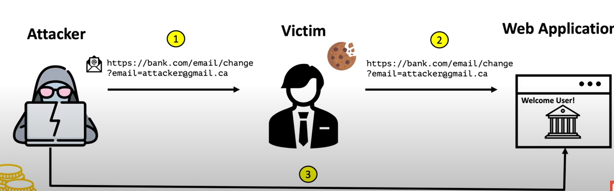
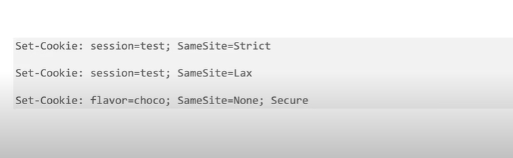

---
## Front matter
lang: ru-RU
title: Ошибки путаницы привилегий, подделка межсайтовых запросов в веб-приложениях.
subtitle: Cross-site request forgery(CSRF)
author:
  - Аристид Жан Лоэнс Аристобуль Надаль
institute:
  - Российский университет дружбы народов, Москва, Россия
date: 19 октобря 2024

## i18n babel
babel-lang: russian
babel-otherlangs: english

## Formatting pdf
toc: false
toc-title: Содержание
slide_level: 2
aspectratio: 169
section-titles: true
theme: metropolis
header-includes:
 - \metroset{progressbar=frametitle,sectionpage=progressbar,numbering=fraction}
---

# Информация

## Докладчик

:::::::::::::: {.columns align=center}
::: {.column width="70%"}

  * Аристид Жан Лоэнс Аристобуль Надаль
  * Студент
  * Российский университет дружбы народов
  
:::
::::::::::::::

# Вводная часть

## Объект и предмет исследования

- Уязвимости веб-сайтов
- безопасность веб-приложений
- роли и разрешения пользователей

## Цели и задачи

- Понять, что такое подделка межсайтовых запросов
- Защитите веб-приложение от такой уязвимости

## Материалы и методы

- обычные инструменты, такие как html, javascript
- веб-браузер
- подключение к интернету

# Элементы презентации

## Актуальность

- Дайте представление о потенциальных уязвимостях вашего веб-приложения
- Предоставьте методы, позволяющие не стать жертвой CSRF-атаки

## Что такое CSRF?

- Подделка межсайтовых запросов (CSRF) - это атака, которая заставляет конечного пользователя выполнять нежелательные действия в веб-приложении, в котором он в данный момент аутентифицирован.

## CSRF scenario
 {width=70%}
 

## Намерения злоумышленников

- изменить электронную почту или пароль жертвы
- купить что-то
- Получить личные данные
  
## Условия CSRF
- Соответствующее действие
- Обработка сессии на основе куки
- Отсутствие непредсказуемых параметров запроса

## Предотвращение уязвимостей CSRF
- CSRF token 
- cookies SameSite

## Токен CSRF
- непредсказуемый
- привязан к сессии пользователя
- проверяется перед удовлетворением запроса
  
## Cookies SameSite
- Strict
- Lax
- None
  {width=70%}
  

## Сканеры уязвимостей веб-приложений (WAVS)
- acunetix 
- аrachni
- wapiti
- Burp Suite

## Итоговый слайд
- Веб-приложения подвержены множеству уязвимостей, о которых веб-разработчик должен знать при программировании своего веб-приложения. Веб-разработчик должен принять необходимые меры для защиты своего сайта от этих уязвимостей, чтобы сохранить данные пользователей и избежать взлома их аккаунтов.
  
## Sources
- https://owasp.org/www-community/attacks/csrf
- Web Application Security: Exploitation and Countermeasures for Modern Web Applications by Andrew Hoffman

