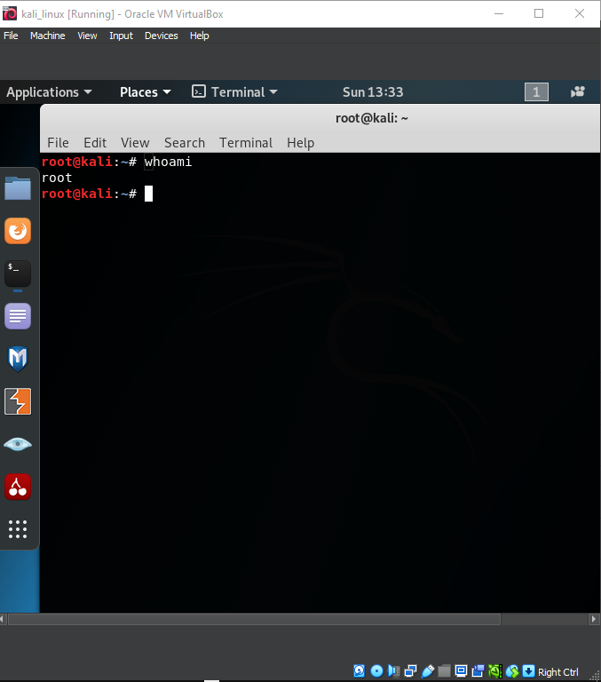

---
## Front matter
lang: ru-RU
title: Презентация индивидуального проекта
subtitle: Первый вариант
author:
  - Аристид Жан Лоэнс Аристобуль
institute:
  - Российский университет дружбы народов, Москва, Россия
date: 14/09/2024

## i18n babel
babel-lang: russian
babel-otherlangs: english

## Formatting pdf
toc: false
toc-title: Содержание
slide_level: 2
aspectratio: 169
section-titles: true
theme: metropolis
header-includes:
  - \metroset{progressbar=frametitle,sectionpage=progressbar,numbering=fraction}
---

# Информация

## Докладчик

:::::::::::::: {.columns align=center}
::: {.column width="70%"}

- Аристид Жан Лоэнс Аристобуль
- студент
- Российский университет дружбы народов

:::
::: {.column width="30%"}

:::
::::::::::::::

# Вводная часть

## Объект и предмет исследования

- Kali Linux

## Цели и задачи

- Установка kali linux в virtual box

## Результаты

Конфигурация kali linux (рис. [-@fig:001]).

{#fig:001 width=70%}

terminal kali linux (рис. [-@fig:002]).

{#fig:002 width=70%}

## Итоговый слайд
